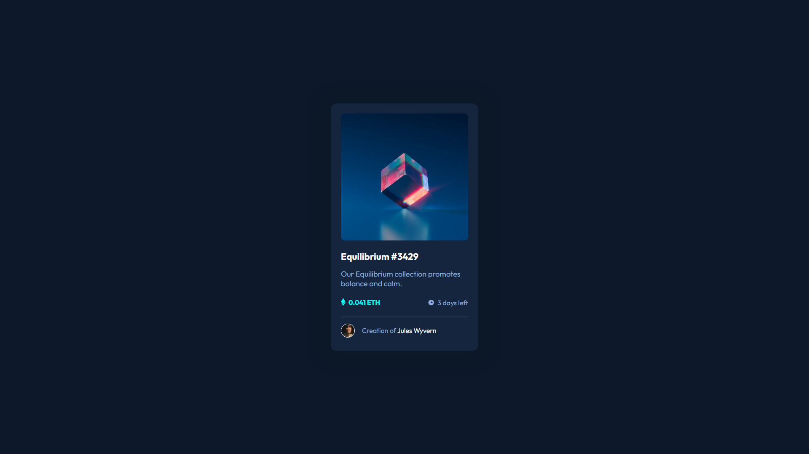

# Frontend Mentor - NFT preview card component solution

This is a solution to the [NFT preview card component challenge on Frontend Mentor](https://www.frontendmentor.io/challenges/nft-preview-card-component-SbdUL_w0U). Frontend Mentor challenges help you improve your coding skills by building realistic projects. 

## Table of contents

- [Overview](#overview)
  - [The challenge](#the-challenge)
  - [Screenshot](#screenshot)
  - [Links](#links)
- [My process](#my-process)
  - [Built with](#built-with)
  - [What I learned](#what-i-learned)
  - [Useful resources](#useful-resources)
- [Author](#author)

## Overview

### The challenge

Users should be able to:

- View the optimal layout depending on their device's screen size
- See hover states for interactive elements

### Screenshot

### Links

- [Solution URL](https://www.frontendmentor.io/solutions/flexbox-nft-card-component-ewl0xkoMAP)
- [Live site URL](http://kapline.me/nft-preview-card-component-main/)

## My process

### Built with

- Semantic HTML5 markup
- CSS custom properties
- Flexbox
- GitHub Pages

### What I learned

This challenge was much more interesting than previous one with QR code.

Interactive elements and more complex position of elements had made this challenge a bit harder. This was a good practice.

### Useful resources

- [Cubic Bezier](https://cubic-bezier.com/) - Awesome site that helped me to add beautiful animations with Bezier curves.

## Author

- Frontend Mentor - [@Kapline](https://www.frontendmentor.io/profile/TrueKapline)